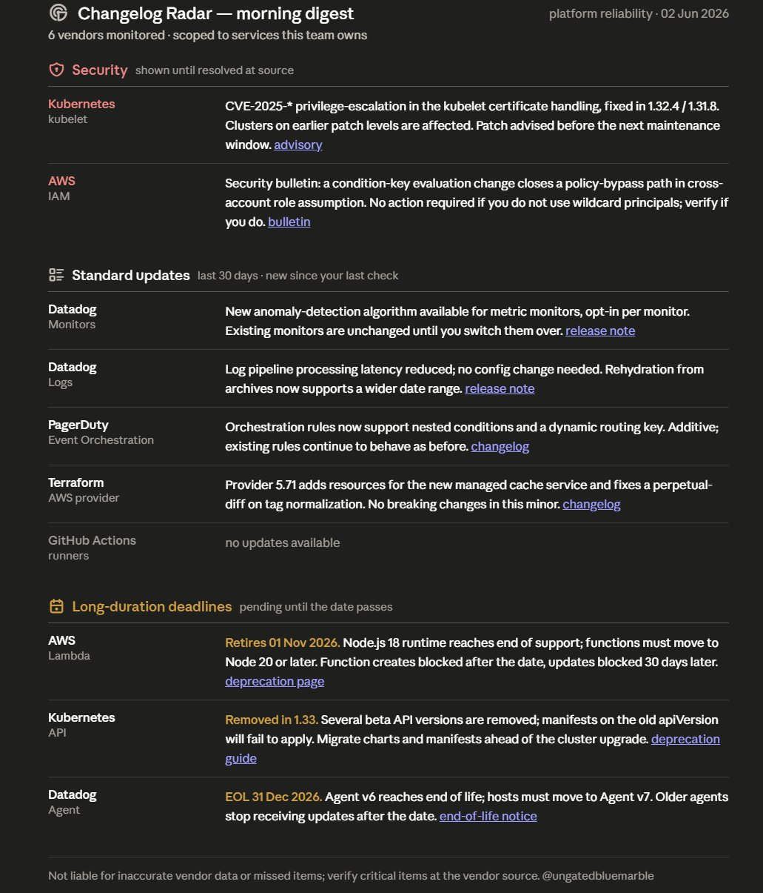

# Changelog Radar

A Claude skill that interviews you about the products and services you actually use, fetches each vendor's release notes live, and returns only the changes relevant to your stack — explained in plain language.

## What makes it different

Most changelog tools dump an entire vendor feed at the reader, or match crude keywords. Changelog Radar does something keyword matching cannot: it interviews you as the expert on your own stack, learns what you actually depend on, and reads a vendor's full changelog before returning only the items that apply to you. You are the source of truth about your own needs. The skill's job is to interview well, source updates reliably, and filter by genuine relevance.

## Default output

Every digest renders as an inline chat widget by default. The widget shows three sections in fixed order: security items (shown until resolved at source), standard updates (governed by your lookback window), and long-duration deadlines (deprecations and end-of-life dates, shown until the date passes). Each row shows the vendor and service on the left and the actionable detail on the right, with a direct link to the source.



## Output modes

Three modes are available.

**Widget (default):** The inline chat widget shown above. Renders automatically on every digest run. Covers all in-scope items regardless of API impact.

**Plain text:** Three markdown tables in the same three-section order. Request this explicitly if you prefer text output or are working in an environment where the widget does not render well.

**Engineering publication:** A self-contained HTML artifact with severity classifications (Action Required, Verify, Info), a table of contents, and callout blocks per item. Filtered to items with direct API or SDK impact. Request this explicitly when you want something to share with an engineering team or publish as a changelog diff.

## How memory works

This is the stateless chat version of the skill. It writes nothing to a file, a repo, or your account instructions. Your tracked vendors and interest profile live only in the conversations where you set them up. When you ask for a digest, the skill silently searches those past conversations to recover your setup and proceeds from there.

One hard consequence: if you delete the conversation where you onboarded a vendor, that vendor's setup is gone. There is no backup. You would need to onboard from scratch. If you want your setup to survive independent of chat history, the Projects version of this skill stores the registry as a Project file and is the correct solution.

This version does not run on a schedule. You run a digest by asking for one.

## Repo structure

```
changelog-radar/
├── SKILL.md                          # Skill instructions loaded by Claude
├── README.md                         # This file
├── assets/
│   ├── digest-preview.png            # Screenshot of the default widget output
│   ├── engineering-template.html     # Base stylesheet for Mode B HTML publication
│   └── registry.example.yaml        # Example registry entries (Zoom, Anthropic) — not an active monitoring list
└── references/
    ├── output-formats.md             # Defines the three output modes and their rules
    ├── ingestion-channels.md         # Per-channel sourcing workflows (RSS, email, search/scrape)
    └── registry-schema.md            # Schema for vendor registry entries and interest profiles
```

## License

Licensed under [CC BY-NC-ND 4.0](https://creativecommons.org/licenses/by-nc-nd/4.0/) (Attribution-NonCommercial-NoDerivatives). You may share this work for noncommercial purposes with attribution. You may not use it commercially or distribute derivative versions. All rights not expressly granted are reserved; see the LICENSE and NOTICE files. For a commercial license, contact [@ungatedbluemarble](https://github.com/ungatedbluemarble).
